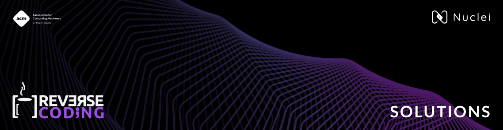

<h1 align="center"> Reverse Coding 2022 </h1>

 
Solutions for the Questions asked during Reverse Coding 2022.

  
    

---

Open-source release of the code used in Reverse Coding 2022.  

Code for both rounds are available in their respective folders, with the names depicting the algorithm the question was designed for.

Code is written in C++, and follows the latest standards, and is formatted using `clang-format`.

---

**Authors:**   
[Rehber Moin](https://github.com/docflex)  
[Aryaman Kolhe](https://github.com/Chasmiccoder)  
Jay Kaoshik  
[Rishu Yadav](https://github.com/rishuyadav)  
**Contributors:**   
[Gagan Malvi](https://github.com/gaganmalvi)
[Harsh Avinash](https://github.com/Harsh-Avinash)
